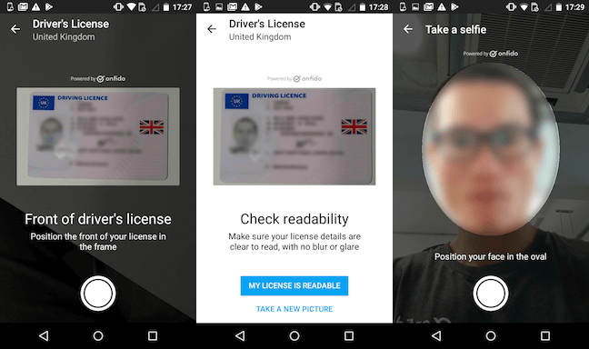

# Onfido Android SDK

[ ](https://bintray.com/onfido/maven/onfido-capture-sdk/_latestVersion)

## Overview

This SDK provides a drop-in set of screens and tools for Android applications to:

1. Take and evaluate the quality of document and face captures
2. Initialise identity verification checks through Onfido's API

The SDK utilises the Onfido API to evaluate and submit images.  To use the API, an Onfido API token is required.



## Setup

The SDK supports API level 16 and above ([distribution stats](https://developer.android.com/about/dashboards/index.html))

### 1. Adding the SDK dependency

You can download a JAR from Github's [releases page](https://github.com/onfido/onfido-android-sdk/releases)

Alternatively, use Gradle:

```gradle
repositories {
  jcenter()
}

dependencies {
  compile 'com.onfido.sdk.capture:onfido-capture-sdk:+'
}
```

Note:

Until this package gets approved to be included in JCenter, the following snippet must be used to instruct gradle to search for it on Bintray:

```gradle
repositories {
  maven {
    url  "https://dl.bintray.com/onfido/maven"
  }
}
```

### 2. Specifying your API token

In your AndroidManifest.xml file, in your root project, add:

```xml
<application>
  <meta-data android:name="onfido_api_token" android:value="<your token>"/>
  <!-- and so on -->
</application>
```

Your API token is available on the [Settings](https://onfido.com/dashboard/settings/api) page of the Onfido dashboard.

## Usage

### 1. Get an Onfido client instance

To use the SDK, you need to obtain an instance of the client object:

```java
final Context context = ...;
Onfido onfido = OnfidoFactory.create(context).getClient();
```

### 2. Create the SDK configuration

The SDK provides several configuration options.

```java
final OnfidoConfig config = OnfidoConfig.builder()
            .withApplicant(applicant)
            .withCustomFlow(steps)
            .build();
```

Descriptions on each method are described below.

#### `withApplicant(Applicant)`
When `withShouldCollectDetails` is `false`, then you must provide applicant details to the SDK.

The following code shows an example of how to create an Applicant object:

```java
Applicant applicant = Applicant.builder()
            .withFirstName("User")
            .withLastName("Last name")
            ...
            .build();
```

Depending on the reports you wish to request, you may also want to add an address for the applicant.

```java
Address address = Address.builder()
                         .withCountry(Locale.UK)
                         .withBuildingName("40")
                         .withStreet("Long Acre")
                         .withTown("London")
                         .withPostcode("WC2E 9LG")
                         .build()

List<Address> list = new LinkedList<>();
list.add(address);

applicant.setAddresses(list);
```

#### `withCustomFlow(FlowStep[])`
Specifies the flow of the SDK. With it you can remove, add and shift around steps of the SDK flow.

```java
final FlowStep[] defaultStepsWithWelcomeScreen = new FlowStep[]{
    new MessageScreenStep("Welcome Screen","Welcome Description","Start"), //Optional
    FlowStep.MESSAGE_IDENTIFY_VERIFICATION, //Identity Verification Intro Step, Optional
    FlowStep.CAPTURE_DOCUMENT,              //Document Capture Step
    FlowStep.MESSAGE_FACE_VERIFICATION,     //Face Capture Intro Step, Optional
    FlowStep.CAPTURE_FACE,                  //Face Capture Step
    FlowStep.FINAL                          //Final Screen Step, Optional
};

final OnfidoConfig config = OnfidoConfig.builder()
    .withCustomFlow(defaultStepsWithWelcomeScreen)
    .withApplicant(applicant)
    .build();
```

##### Document Capture Step
In this step the user can pick which type of document to capture and then use the phone camera to capture it.

##### Face Capture Step
In this step the user can capture a photo of his face, by use of the front camera.

##### Message Screen Step (Optional)
This screen can be used to create a customized information step. It can be inserted anywhere in the flow multiple times.
It can be instantiated with the following constructor:`MessageScreenStep(String, String, String)`

##### Final Screen Step (Optional)
This is a form of **Message Screen Step**. It should be used at the end of the flow, but it's not necessary.

##### Identity Verification Intro Step (Optional)
This is a form of **Message Screen Step**. It explains to the user the purpose of the identity verification flow.

##### Face Capture Intro Step (Optional)
This is a form of **Message Screen Step**. It explains to the user the purpose of the face capture step which should follow this one.

### 3. Start the SDK flow

To start the SDK flow, you should first obtain an *Intent* from the client and use it to start the SDK's activity that runs the background check process. We recommend using **startActivityForResult** to receive the result of the process (to know if the user finished or cancelled the check process).

An example of how to start the process from your app's Activity:

```java
// get client instance
final Onfido onfido = OnfidoFactory.create(this).getClient();
// create your config
final OnfidoConfig config = ...

// start the flow. 1 should be your request code (customise as needed)
onfido.startActivityForResult(this,         /*must be an activity*/
                              1,            /*this request code will be consumed later on Activity Result*/
                              onfidoConfig);
```

To receive the result from the flow, you should override the method **onActivityResult**.

```java
@Override
protected void onActivityResult(int requestCode, int resultCode, Intent data) {
    ...
    client.handleActivityResult(requestCode, resultCode, data, new Onfido.OnfidoResultListener() {
        @Override
        public void success(Applicant applicant, OnfidoAPI onfidoApi, OnfidoConfig config) {
            startCheck(onfidoConfig, applicant, onfidoAPI);
        }

        @Override
        public void userExited(Applicant applicant, OnfidoAPI onfidoApi, OnfidoConfig config) {
            //User left the sdk flow without completing it
        }
    });
}
```

You can then initiate a check in the following manner:

```java
private void startCheck(OnfidoConfig config, Applicant applicant, OnfidoAPI onfidoAPI){
    ...
    final List<Report> currentReports = new ArrayList<>();
    currentReports.add(new Report(Report.Type.DOCUMENT));
    currentReports.add(new Report(Report.Type.IDENTITY));

    onfidoAPI.check(applicant, Check.Type.EXPRESS, currentReports, new OnfidoAPI.Listener<Check>() {
        @Override
        public void onSuccess(Check check) {
            //check request has been successful, the result of the check is passed
        }

        @Override
        public void onFailure() {
            //Failed to execute the request
        }

        @Override
        public void onError(ErrorData errorData) {
            //request was done, but the onfido api returned an error
        }
    });
}
```

From those examples you can see that we used two methods that are provided by the Onfido class:

### 4. Check Results and Callbacks

If you've elected to process checks asynchronously, you'll need to setup a webhook on your backend to receive these results and process them appropriately.

You can register to (receive webhook events)[https://onfido.com/documentation#webhooks] using the Onfido API.  These can also be configured on the Onfido dashboard.

## More Information

Further information about the underlying Onfido API is available in our documentation [here](https://onfido.com/documentation).
